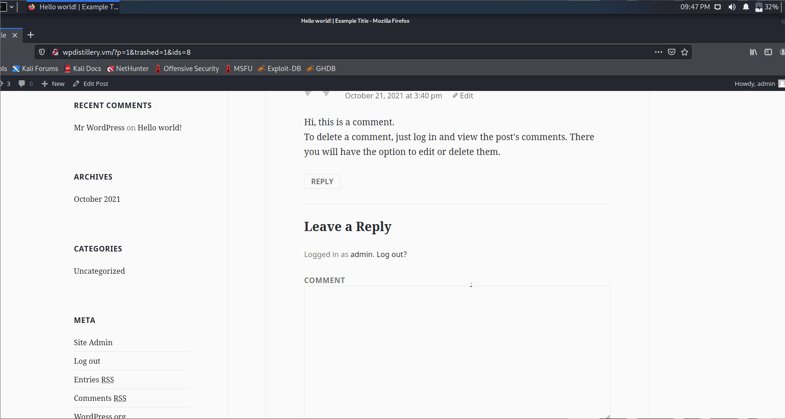
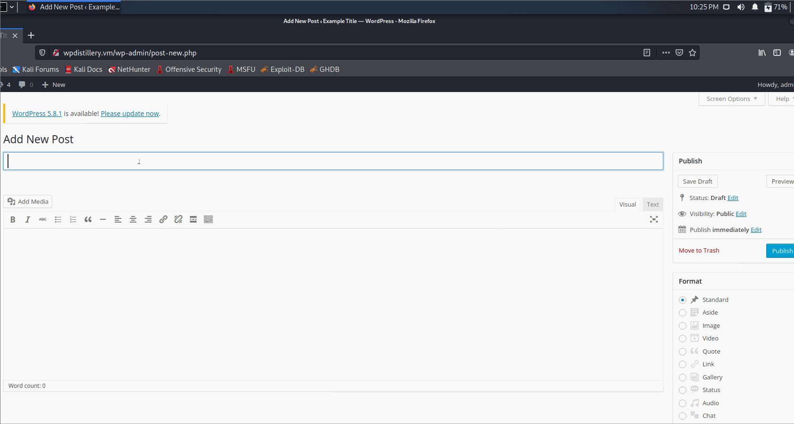

# Project 7 - WordPress Pentesting

Time spent: **X** hours spent in total

> Objective: Find, analyze, recreate, and document **five vulnerabilities** affecting an old version of WordPress

Pentesting Report

1. (Required) Authenticated Cross-Site Scripting(XSS) using Media File Metadata
  - [x] Summary: Sometimes media file(Audio File) meta data information (ID3) may result in an XSS attack. 
    - Vulnerability types: Cross-Site Scripting(XSS)
    - Tested in version: 4.2
    - Fixed in version: 4.2.13
  - [x] GIF Walkthrough:  
  - [x] Steps to recreate: 1) upload a small mp3 file
  						   2) in the description add "Sample mp3 </noscript>".
  						   3) Click on view attachment page
  						   4) refresh the page. A XSS attack is generated.  
  - [x] Affected source code:
    - [Media](https://core.trac.wordpress.org/browser/branches/4.2/src/wp-admin/includes/media.php)

2. (Required) User Enumeration 
  - [x] Summary: If the user puts different values fro username and password, it may lead to user enumeration as 2 different errors are generated. The user can get a hint to the username or password. 
    - Vulnerability types: User Enueration
    - Tested in version: 4.2
    - Fixed in version:  4.3
  - [x] GIF Walkthrough: 
  - [x] Steps to recreate: 
  						  1) Putting in username as "random" with incorrect password gives the error message Invalid Username
  						  2) Putting in username as "admin" with incorrect password gives the error message the password you entered for the username admin is incorrect 

  - [x] Affected source code:
    - [Login](https://core.trac.wordpress.org/browser/tags/4.2/src/wp-login.php)

3. (Required) Legacy Theme Preview Cross-Site Scripting (XSS)
  - [x] Summary: An XSS vulnerability can be found in the preview theme function where one of the  callbacks that it takes as argument filters out onclick handlers. It is then possible for an attacker to craft a XSS script.  
    - Vulnerability types: Cross-Site Scripting(XSS)
    - Tested in version: 4.2
    - Fixed in version:  4.2.5
  - [x] GIF Walkthrough:  
  - [x] Steps to recreate: In a post comment, insert the following script <a href='/wp-admin/' title="" style="position:absolute;top:0;left:0;width:100%;height:100%;display:block;" onmouseover=alert(document.cookie)//'>Test</a>
  - [x] Affected source code:
    - [Preview Theme Function](<a href='/wp-admin/' title="" style="position:absolute;top:0;left:0;width:100%;height:100%;display:block;" onmouseover=alert(document.cookie)//'>Test</a>)

4. (Optional) Authenticated Stored Cross-Site Scripting (XSS) in YouTube URL Embeds
  - [x] Summary: 
    - Vulnerability types: Cross-Site Scripting(XSS)
    - Tested in version: 4.2
    - Fixed in version: 4.2.13
  - [x] GIF Walkthrough:  
  - [x] Steps to recreate: 
  							1) Create a brand new post
  							2) Put the comment as [embed src='https://youtube.com/embed/12345\x3csvg onload=alert(document.cookie)\x3e'][/embed]
  							3) click publish
  							4) View the created post and new XSS attack is generated.
  - [x] Affected source code: 
    - [Auto Embed Function](https://core.trac.wordpress.org/browser/trunk/src/wp-includes/class-wp-embed.php)

5. (Optional) XSS attack when Large File is Uploaded
  - [x] Summary: 
    - Vulnerability types: Cross-Site Scripting(XSS)
    - Tested in version: 4.2
    - Fixed in version: 4.2.15
  - [x] GIF Walkthrough: 
  - [x] Steps to recreate: 
  - [x] Affected source code:
    - [Link 1](https://core.trac.wordpress.org/browser/tags/version/src/source_file.php) 

Assets

List any additional assets, such as scripts or files

Resources

- [WordPress Source Browser](https://core.trac.wordpress.org/browser/)
- [WordPress Developer Reference](https://developer.wordpress.org/reference/)

GIFs created with [LiceCap](http://www.cockos.com/licecap/).

Notes

Describe any challenges encountered while doing the work

License

    Copyright [2021] [Tejashw Roul]

    Licensed under the Apache License, Version 2.0 (the "License");
    you may not use this file except in compliance with the License.
    You may obtain a copy of the License at

        http://www.apache.org/licenses/LICENSE-2.0

    Unless required by applicable law or agreed to in writing, software
    distributed under the License is distributed on an "AS IS" BASIS,
    WITHOUT WARRANTIES OR CONDITIONS OF ANY KIND, either express or implied.
    See the License for the specific language governing permissions and
    limitations under the License.
